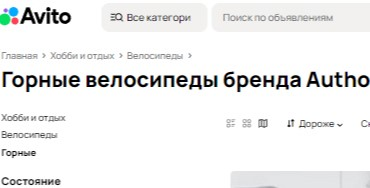
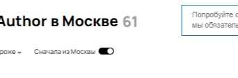
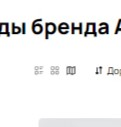
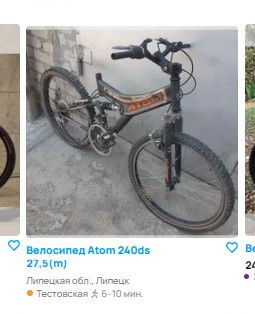
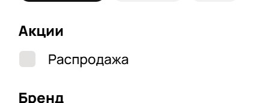
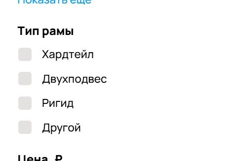

# Баги

1. **ОР**: Название «Все категории» в кнопке сверху.
**ФР**: Описка «Все категори» в кнопке сверху
**Приоритет**: high

2. **ОР**: В поисковой строке в качестве плейсхолдера указано "Поиск по объявлениям"
**ФР**: Описка "Поиск по обьявлениям" (плохое качество скрина)
**Приоритет**: high

3. **ОР**: В результатах поиска 9 объявлений - как заявлено в кнопке фильтров
**ФР**: В итоге найдено 100 страниц объявлений
**Приоритет**: meduim

4. **ОР**: В результатах поиска 9 объявлений - как заявлено в кнопке фильтров
**ФР**: Наверху страницы указано, что найдено 61 объявление
**Приоритет**: meduim

5. **ОР**: При выборе сортировки "сначала дороже" объявления отсортированы по цене.
**ФР**: На 7ом объявлении сортировка ломается - объявление дороже, чем предыдущее
**Приоритет**: meduim

6. **ОР**: У всех объявлений указана цена
**ФР**: У 8ого объявления нет цены
**Приоритет**: low

7. **ОР**: Объявления подобраны по марке, указанной в фильтрах
**ФР**: У 8ого объявления не та марка - Atom
**Приоритет**: meduim

8. **ОР**: У объявлений указано ближайшее метро
**ФР**: У 12ого объявления указано до метро идти 11-15 ч
**Приоритет**: meduim

9. **ОР**: Вид отображения объявлений выбран «на карте», отображается карта
**ФР**: Вид отображения выбран «на карте», а отображается «сеткой»
**Приоритет**: high

10. **ОР**: В категориях сверху указана последняя категория "Главная > Хобби и отдых > Велосипеды > Горные"
**ФР**: Последняя категория не указана: "Главная > Хобби и отдых > Велосипеды"
**Приоритет**: low

11. **ОР**: Указаны действующие станции метро
**ФР**: "Звенигородская" станция метро откроется только в 2026 году
**Приоритет**: medium

12. **ОР**: Объявления с метро "Тестовская" расположены в Москве 
**ФР**: Есть велосипед с адресом "Тестовская", но вместо указана Липецкая обл и город Липецк
**Приоритет**: meduim

13. **ОР**: Объявления найдены только по Москве в соответствии с названием поиска
**ФР**: Есть велосипед с адресом в "Липецкая обл., Липецк"
**Приоритет**: meduim

14. **ОР**: Указаны действующие станции метро
**ФР**: Станции метро Ховин в москве нет - это нижний велик в середине
**Приоритет**: high

### Далее идут баги, найденные при сравнении скриншота с текущей версией Авито

15. **ОР**: справа сверху напротив поиска надпись "Москва, район, метро, радиус"
**ФР**: справа сверху напротив поиска надпись "Москва, район, метро"
**Приоритет**: low

16. **ФР**: В фильтрах нет вкладки акции "распродажа"
**Приоритет**: meduim

17. **ОР**: Кнопки "Все категории" и поиска должны быть покрашены синим цветом
**ФР**: Кнопки "Все категории" и поиска чёрные
**Приоритет**: low

18. **ОР**: Должно быть больше объявлений на странице - 10 строк
**ФР**: На скрине 4 строки на страницу
**Приоритет**: meduim

19. **ОР**: есть фильтр "тип рамы"
**ФР**: нет фильтра "тип рамы"
**Приоритет**: meduim

20. **ОР**: Есть реклама
**ФР**: Нет рекламы
**Приоритет**: high

21. **ОР**: Неизвестно
**ФР**: Отображается блок "Попробуйте обновить страницу или загляните позже —
мы обязательно всё починим."
**Приоритет**: high